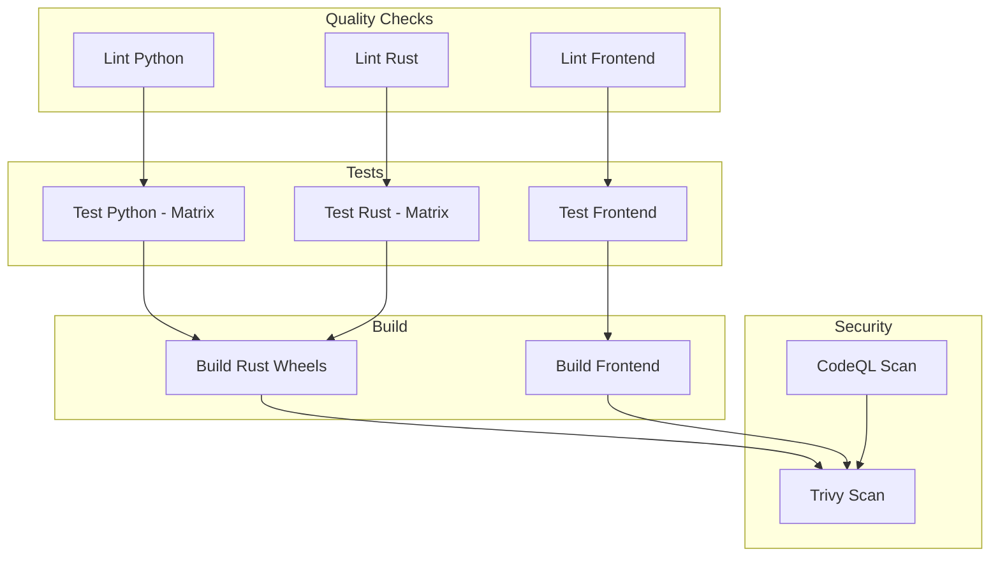
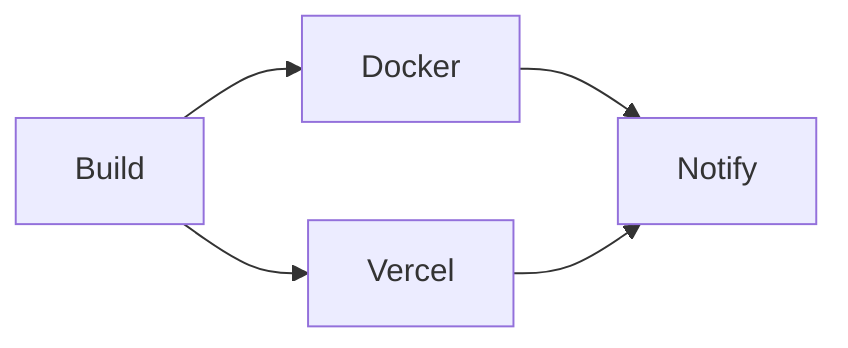
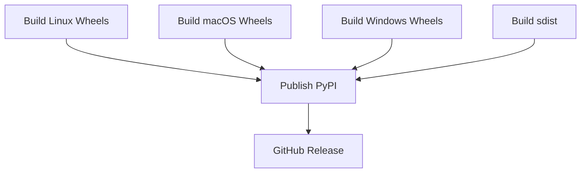

# CI/CD Pipeline Documentation

## Overview

This document describes the complete CI/CD pipeline for a Python + Rust + Vue full-stack project. The pipeline is designed for:

- **Fast feedback** on pull requests
- **Multi-platform builds** (Linux, macOS, Windows)
- **Docker image optimization** (3GB → 200MB)
- **Automated releases** to PyPI and GitHub
- **Vercel deployments** for frontend

---

## Workflow Files

```
.github/
├── workflows/
│   ├── ci.yml           # Main CI pipeline
│   ├── deploy.yml       # Deployment pipeline
│   └── release.yml      # Release pipeline
├── dependabot.yml       # Dependency updates
└── SETTINGS.md          # Repository configuration
```

---

## Pipeline Stages

### 1. CI Pipeline (`ci.yml`)

**Trigger**: Push/PR to main/develop



### 2. Deploy Pipeline (`deploy.yml`)

**Trigger**: Push to main, tags, manual dispatch



### 3. Release Pipeline (`release.yml`)

**Trigger**: Version tags (v*)



---

## Caching Strategies

### Python Cache

```yaml
- name: Set up Python
  uses: actions/setup-python@v5
  with:
    python-version: '3.12'
    cache: 'pip'
    cache-dependency-path: |
      **/pyproject.toml
      **/requirements*.txt
```

**Cache key**: `pip-${{ runner.os }}-${{ hashFiles('**/requirements*.txt') }}`

### Rust Cache

```yaml
- name: Cache cargo
  uses: Swatinem/rust-cache@v2
  with:
    workspaces: './rust -> target'
```

**Cache key**: `cargo-${{ runner.os }}-${{ hashFiles('**/Cargo.lock') }}`

### Node.js Cache (pnpm)

```yaml
- name: Set up Node.js
  uses: actions/setup-node@v6
  with:
    node-version: '22'
    cache: 'pnpm'
    cache-dependency-path: 'src/frontend/pnpm-lock.yaml'
```

### Docker Build Cache

```yaml
- name: Build Docker image
  uses: docker/build-push-action@v6
  with:
    cache-from: type=gha
    cache-to: type=gha,mode=max
```

**Cache hit rate**: ~70% reduction in build time

---

## Multi-Platform Builds

### Matrix Strategy

```yaml
strategy:
  fail-fast: false
  matrix:
    os: [ubuntu-latest, macos-latest, windows-latest]
    python-version: ['3.11', '3.12', '3.13']
```

### Maturin Wheel Builds

| Platform | Targets | Notes |
|----------|---------|-------|
| Linux | x86_64, aarch64 | manylinux auto |
| macOS | x86_64, aarch64 | Apple Silicon support |
| Windows | x64 | MSVC toolchain |

### Cross-Compilation

For faster builds, use cross-compilation instead of native runners:

```yaml
- name: Build for multiple targets
  uses: PyO3/maturin-action@v1
  with:
    target: ${{ matrix.target }}
    manylinux: auto
    sccache: true  # Enable remote caching
```

---

## Docker Optimization

### Multi-Stage Build

```dockerfile
# Stage 1: Build Rust module (~2GB)
FROM rust:1.85-slim AS rust-builder

# Stage 2: Build Python deps (~1GB)
FROM python:3.12-slim AS python-builder

# Stage 3: Build Vue app (~500MB)
FROM node:22-alpine AS frontend-builder

# Stage 4: Runtime (~200MB)
FROM python:3.12-slim AS runtime
```

### Size Comparison

| Approach | Image Size | Build Time |
|----------|------------|------------|
| Single-stage | ~3.5GB | 10-15 min |
| Multi-stage | ~200MB | 5-8 min |
| Distroless | ~120MB | 5-8 min |

### Layer Caching Trick

Build dependencies before copying source:

```dockerfile
# Cache dependencies
COPY Cargo.toml Cargo.lock ./
RUN mkdir src && echo "fn main() {}" > src/main.rs
RUN cargo build --release

# Build actual code
COPY src ./src
RUN cargo build --release
```

---

## Security Scanning

### CodeQL Analysis

```yaml
- name: Initialize CodeQL
  uses: github/codeql-action/init@v4
  with:
    languages: python, javascript, rust
```

### Trivy Container Scanning

```yaml
- name: Run Trivy scanner
  uses: aquasecurity/trivy-action@master
  with:
    scan-type: 'fs'
    format: 'sarif'
```

---

## Vercel Deployment

### Preview Deployments (PRs)

```yaml
- name: Deploy Preview
  uses: amondnet/vercel-action@v25
  with:
    vercel-token: ${{ secrets.VERCEL_TOKEN }}
    vercel-project-id: ${{ secrets.VERCEL_PROJECT_ID }}
```

### Production Deployment

```yaml
- name: Deploy Production
  uses: amondnet/vercel-action@v25
  with:
    vercel-token: ${{ secrets.VERCEL_TOKEN }}
    vercel-args: '--prod'
```

---

## Performance Metrics

### Typical CI Run Times

| Job | Duration | Cached |
|-----|----------|--------|
| lint-python | 1-2 min | Yes |
| lint-rust | 2-3 min | Yes |
| lint-frontend | 2-3 min | Yes |
| test-python | 3-5 min | Yes |
| test-rust | 5-10 min | Yes |
| test-frontend | 3-5 min | Yes |
| build-wheels | 10-15 min | Partial |
| docker-build | 5-8 min | Yes |

### Total Pipeline Time

- **First run**: ~25-30 minutes
- **Cached run**: ~10-15 minutes
- **Parallel execution**: Reduces total by 40%

---

## Best Practices

### 1. Fast Feedback

- Run linting first, before tests
- Use `fail-fast: false` for matrix jobs
- Cache aggressively

### 2. Parallel Execution

- Run lint jobs in parallel
- Use matrix strategy for multi-version tests
- Split build and test into separate jobs

### 3. Security

- Use OIDC for cloud authentication
- Scan dependencies and containers
- Never expose secrets in logs

### 4. Maintainability

- Use reusable workflows for common patterns
- Document configuration in comments
- Use Dependabot for updates

---

## Troubleshooting

### Cache Misses

```bash
# Clear cache manually
gh cache delete --all
```

### Build Failures

```yaml
# Enable debug logging
env:
  ACTIONS_STEP_DEBUG: true
  ACTIONS_RUNNER_DEBUG: true
```

### Slow Builds

1. Check cache hit rate
2. Use `sccache` for distributed caching
3. Split large jobs into smaller ones

---

## References

- [GitHub Actions Documentation](https://docs.github.com/en/actions)
- [Maturin Distribution Guide](https://www.maturin.rs/distribution)
- [Vite Deployment Guide](https://vite.dev/guide/static-deploy)
- [Docker Multi-Stage Builds](https://docs.docker.com/build/building/multi-stage/)
- [Vercel for GitHub](https://vercel.com/docs/git/vercel-for-github)