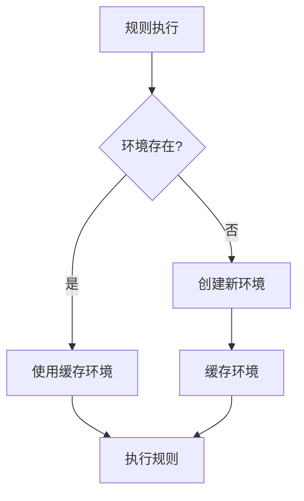

# Conda 环境管理

了解如何在 BioWorkflow 中管理和使用 Conda 环境来确保工作流的可重复性。

## 概述

BioWorkflow 内置 Conda 环境管理功能，支持自动创建、管理和切换工作流所需的软件环境。通过与 Snakemake 的深度集成，可以确保每个规则在正确的环境中执行，实现工作流的可重复性。

### 主要特性

- **自动环境创建**: 根据工作流定义自动创建 Conda 环境
- **环境缓存**: 环境创建后自动缓存，避免重复创建
- **版本锁定**: 支持 Conda 环境的精确版本锁定
- **环境隔离**: 每个工作流独立的环境空间
- **批量管理**: 支持环境的批量创建、更新和删除

## 前置条件

在使用 Conda 环境管理前，请确保：

1. 系统已安装 Miniconda 或 Anaconda
2. BioWorkflow 已正确配置 Conda 路径
3. 有足够的磁盘空间存储环境（建议 50GB+）
4. 网络可访问 Conda 仓库

## 使用指南

### 配置 Conda

#### 设置 Conda 路径

```bash
# .env 文件
CONDA_PREFIX=/opt/conda
CONDA_ENVS_PATH=/data/conda_envs
```

#### 在工作流中使用 Conda

```python
# workflow.smk
rule fastqc:
    input: "data/{sample}.fastq"
    output: "qc/{sample}_fastqc.html"
    conda: "envs/fastqc.yaml"
    shell: "fastqc {input} -o qc/"
```

### 环境定义文件

创建 Conda 环境定义文件：

```yaml
# envs/fastqc.yaml
name: fastqc
channels:
  - bioconda
  - conda-forge
  - defaults
dependencies:
  - fastqc=0.11.9
  - multiqc=1.12
  - python=3.10
```

### 环境管理操作

#### 创建环境

```bash
# 通过 CLI 创建
bioworkflow conda create -n myenv -f envs/myenv.yaml

# 通过 API 创建
curl -X POST http://localhost:8000/api/conda/environments \
  -H "Authorization: Bearer YOUR_TOKEN" \
  -F "file=@envs/myenv.yaml" \
  -F "name=myenv"
```

#### 列出环境

```bash
# CLI 列出
bioworkflow conda list

# API 列出
curl http://localhost:8000/api/conda/environments \
  -H "Authorization: Bearer YOUR_TOKEN"
```

#### 删除环境

```bash
# 删除单个环境
bioworkflow conda remove -n myenv

# 删除未使用的环境
bioworkflow conda prune
```

## 示例

### 完整的 ChIP-seq 分析环境

```yaml
# envs/chipseq.yaml
name: chipseq-pipeline
channels:
  - bioconda
  - conda-forge
dependencies:
  # 质控
  - fastqc=0.11.9
  - multiqc=1.12
  
  # 比对
  - bwa=0.7.17
  - samtools=1.15
  - bowtie2=2.5.0
  
  # 峰调用
  - macs2=2.2.7.1
  - bedtools=2.30.0
  
  # 可视化
  - deeptools=3.5.1
  
  # R 分析
  - r-base=4.2
  - bioconductor-deseq2
  - bioconductor-chipseeker
```

### 多环境工作流示例

```python
# chipseq.smk
configfile: "config.yaml"

rule all:
    input:
        expand("peaks/{sample}_peaks.narrowPeak", sample=config["samples"])

rule quality_control:
    input: "data/{sample}.fastq.gz"
    output: "qc/{sample}_fastqc.html"
    conda: "envs/qc.yaml"
    threads: 4
    shell:
        "fastqc -t {threads} {input} -o qc/"

rule align:
    input: "data/{sample}.fastq.gz"
    output: "bam/{sample}.bam"
    conda: "envs/alignment.yaml"
    threads: 8
    params:
        index=config["reference_index"]
    shell:
        """
        bwa mem -t {threads} {params.index} {input} | \
            samtools view -bS - > {output}
        """

rule call_peaks:
    input: "bam/{sample}.bam"
    output: "peaks/{sample}_peaks.narrowPeak"
    conda: "envs/peakcalling.yaml"
    params:
        genome=config["genome"]
    shell:
        "macs2 callpeak -t {input} -n {wildcards.sample} -g {params.genome} --outdir peaks/"
```

## 环境缓存机制

BioWorkflow 实现了智能环境缓存：



### 缓存配置

```yaml
# config.yaml
conda:
  cache_dir: "/data/conda_cache"
  max_cache_size: "100G"
  cleanup_interval: "7d"  # 清理 7 天未使用的环境
```

## 最佳实践

### 1. 环境版本锁定

使用精确版本号确保可重复性：

```yaml
# 推荐：锁定版本
dependencies:
  - fastqc=0.11.9=hdfd78af_1
  - samtools=1.15=h1170115_1

# 避免：使用通配符
dependencies:
  - fastqc>=0.11
  - samtools*
```

### 2. 渠道优先级

正确设置渠道优先级：

```yaml
channels:
  - bioconda      # 生物信息软件
  - conda-forge   # 通用软件
  - defaults      # 默认渠道
```

### 3. 环境大小优化

```bash
# 清理缓存
conda clean --all

# 导出最小环境
conda env export -n myenv --no-builds > env.yaml

# 从历史创建环境
conda env export -n myenv --from-history > env.yaml
```

## 故障排除

### 常见问题

#### 1. 环境创建失败

**症状**: Conda 环境创建超时或失败

**解决方案**:

```bash
# 使用国内镜像
conda config --add channels https://mirrors.tuna.tsinghua.edu.cn/anaconda/pkgs/free/
conda config --add channels https://mirrors.tuna.tsinghua.edu.cn/anaconda/cloud/bioconda/

# 增加求解器时间
conda config --set solver_timeout 300
```

#### 2. 包版本冲突

**症状**: 依赖解析失败

**解决方案**:

```bash
# 使用 Mamba 加速求解
conda install mamba -n base -c conda-forge
mamba env create -f env.yaml

# 或使用 libmamba 求解器
conda config --set solver libmamba
```

#### 3. 磁盘空间不足

**症状**: 环境创建因磁盘空间失败

**解决方案**:

```bash
# 清理未使用的环境
bioworkflow conda prune --days 30

# 移动环境到更大的磁盘
mv /opt/conda/envs /data/conda_envs
ln -s /data/conda_envs /opt/conda/envs
```

## 高级配置

### 私有仓库配置

```bash
# 配置私有仓库
conda config --add channels https://your-repo.com/conda/

# 使用 token 认证
conda config --set channel_alias https://your-repo.com/t/$CONDA_TOKEN/conda/
```

### 环境预构建

```python
# 使用预构建环境加快启动
rule all:
    input: "results/output.txt"
    conda:
        "prebuilt:fastqc"  # 使用预构建环境
```

## 相关文档

- [工作流管理](workflows.md)
- [配置文件说明](configuration.md)
- [常见问题](../reference/faq.md)
- [环境变量参考](../reference/environment.md)