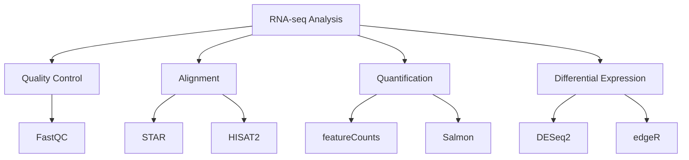

# 知识库系统

了解如何使用 BioWorkflow 的知识库系统进行文档管理和智能检索。

## 概述

BioWorkflow 集成了基于 Elasticsearch 的知识库系统，支持存储、检索和管理生物学相关的知识文档。结合 AI 能力，可以实现语义搜索和智能问答，帮助研究人员快速找到所需信息。

### 主要特性

- **全文检索**: 基于 Elasticsearch 的高性能搜索引擎
- **语义搜索**: AI 驱动的自然语言查询
- **文档管理**: 支持多种文档格式（PDF、Markdown、Word）
- **标签系统**: 灵活的文档分类和组织
- **版本控制**: 文档的历史版本管理
- **知识图谱**: 文档间的关联关系

## 前置条件

在使用知识库前，请确保：

1. Elasticsearch 服务已启动并配置
2. 具有足够的存储空间用于索引
3. 已配置 AI 服务（可选，用于语义搜索）
4. 网络可访问 Elasticsearch API

## 使用指南

### 文档管理

#### 上传文档

```bash
# CLI 上传
bioworkflow knowledge upload \
  --file paper.pdf \
  --title "RNA-seq Methods Paper" \
  --tags rna-seq,methods,paper

# API 上传
curl -X POST http://localhost:8000/api/knowledge/documents \
  -H "Authorization: Bearer YOUR_TOKEN" \
  -F "file=@paper.pdf" \
  -F "title=RNA-seq Methods Paper" \
  -F "tags=rna-seq,methods,paper"
```

#### 创建文档

```python
# 通过 API 创建 Markdown 文档
import requests

document = {
    "title": "ChIP-seq Best Practices",
    "content": """
# ChIP-seq Best Practices

## 实验设计

1. 设置适当的对照
2. 确保足够的测序深度
3. 使用生物学重复

## 数据分析

### 质控标准
- FastQC > 30
- 比对率 > 70%
- 峰数合理
""",
    "format": "markdown",
    "tags": ["chip-seq", "best-practices", "tutorial"]
}

response = requests.post(
    "http://localhost:8000/api/knowledge/documents",
    headers={"Authorization": "Bearer YOUR_TOKEN"},
    json=document
)
```

### 搜索文档

#### 关键词搜索

```python
# 简单关键词搜索
results = requests.get(
    "http://localhost:8000/api/knowledge/search",
    headers={"Authorization": "Bearer YOUR_TOKEN"},
    params={"q": "RNA-seq differential expression"}
)

# 高级搜索
results = requests.post(
    "http://localhost:8000/api/knowledge/search",
    headers={"Authorization": "Bearer YOUR_TOKEN"},
    json={
        "query": "RNA-seq",
        "filters": {
            "tags": ["methods"],
            "created_after": "2023-01-01"
        },
        "sort": {"created_at": "desc"},
        "size": 20
    }
)
```

#### 语义搜索

```python
# 使用自然语言查询
response = requests.post(
    "http://localhost:8000/api/knowledge/semantic-search",
    headers={"Authorization": "Bearer YOUR_TOKEN"},
    json={
        "query": "如何处理 RNA-seq 数据中的批次效应？",
        "top_k": 10
    }
)

for result in response.json()["results"]:
    print(f"Score: {result['score']}")
    print(f"Title: {result['title']}")
    print(f"Excerpt: {result['excerpt']}")
```

### 文档组织

#### 使用标签

```python
# 为文档添加标签
requests.patch(
    f"http://localhost:8000/api/knowledge/documents/{doc_id}",
    headers={"Authorization": "Bearer YOUR_TOKEN"},
    json={
        "tags": ["rna-seq", "tutorial", "beginner"]
    }
)

# 按标签浏览
requests.get(
    "http://localhost:8000/api/knowledge/documents",
    params={"tag": "rna-seq"}
)
```

#### 创建集合

```python
# 创建文档集合
collection = requests.post(
    "http://localhost:8000/api/knowledge/collections",
    headers={"Authorization": "Bearer YOUR_TOKEN"},
    json={
        "name": "RNA-seq Analysis Pipeline",
        "description": "RNA-seq 分析的完整文档集",
        "document_ids": ["doc1", "doc2", "doc3"]
    }
)
```

## 示例

### 构建分析流程知识库

```python
import requests

# API 配置
BASE_URL = "http://localhost:8000/api/knowledge"
HEADERS = {"Authorization": "Bearer YOUR_TOKEN"}

# 创建 RNA-seq 分析知识库
documents = [
    {
        "title": "RNA-seq Quality Control",
        "content": """
# RNA-seq 质量控制

## 质控指标

- Phred Score > 30
- GC 含量分布正常
- 无过度序列

## 工具推荐

- FastQC
- MultiQC
- Trimmomatic
""",
        "tags": ["rna-seq", "qc", "tutorial"]
    },
    {
        "title": "RNA-seq Alignment",
        "content": """
# RNA-seq 比对

## 比对工具

| Tool | Pros | Cons |
|------|------|------|
| STAR | 快速、灵敏 | 内存占用大 |
| HISAT2 | 内存友好 | 稍慢 |

## 推荐参数

```bash
STAR --runThreadN 8 \
     --genomeDir $GENOME \
     --readFilesIn $READS \
     --outSAMtype BAM SortedByCoordinate
```
""",
        "tags": ["rna-seq", "alignment", "tutorial"]
    }
]

for doc in documents:
    requests.post(f"{BASE_URL}/documents", headers=HEADERS, json=doc)
```

### AI 辅助问答

```python
# 向知识库提问
question = "RNA-seq 分析中如何选择比对工具？"

response = requests.post(
    f"{BASE_URL}/qa",
    headers=HEADERS,
    json={"question": question}
)

print(response.json()["answer"])
# 输出基于知识库文档的智能回答
```

## 集成工作流

### 从工作流生成文档

```python
# 自动从工作流生成文档
workflow_id = "rna-seq-pipeline"

response = requests.post(
    f"http://localhost:8000/api/workflows/{workflow_id}/document",
    headers=HEADERS
)

# 生成的文档包含：
# - 工作流描述
# - 输入/输出说明
# - 参数说明
# - 执行示例
```

### 在工作流中引用知识

```python
# 工作流规则中引用知识库文档
rule fastqc:
    input: "data/{sample}.fastq"
    output: "qc/{sample}_fastqc.html"
    knowledge:
        title: "Quality Control Guide"
        link: "kb://rna-seq-qc"
    shell:
        "fastqc {input} -o qc/"
```

## 高级功能

### 知识图谱



### 文档嵌入生成

```python
# 为文档生成向量嵌入
requests.post(
    f"{BASE_URL}/documents/{doc_id}/embed",
    headers=HEADERS
)
```

## 故障排除

### 常见问题

#### 1. Elasticsearch 连接失败

**症状**: 无法连接到 Elasticsearch

**解决方案**:

```bash
# 检查 Elasticsearch 状态
curl http://localhost:9200/_cluster/health

# 检查配置
# .env
ELASTICSEARCH_HOST=localhost
ELASTICSEARCH_PORT=9200
```

#### 2. 搜索结果不相关

**症状**: 搜索结果与预期不符

**解决方案**:

```python
# 调整搜索权重
response = requests.post(
    f"{BASE_URL}/search",
    headers=HEADERS,
    json={
        "query": "RNA-seq",
        "boost": {
            "title": 2.0,      # 标题权重加倍
            "content": 1.0,
            "tags": 1.5
        }
    }
)
```

#### 3. 文档上传失败

**症状**: 大文件上传超时

**解决方案**:

```bash
# 增加上传超时时间
# nginx.conf
client_max_body_size 100M;
proxy_read_timeout 300s;
```

## 相关文档

- [MCP 服务集成](mcp.md)
- [API 参考](../api/endpoints.md)
- [配置文件说明](configuration.md)
- [常见问题](../reference/faq.md)