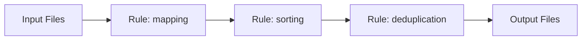

# 工作流管理指南

了解如何在 BioWorkflow 中创建、管理和执行 Snakemake 工作流。

## 概述

BioWorkflow 提供完整的 Snakemake 工作流管理功能，支持工作流的可视化设计、版本控制、执行监控和结果管理。工作流系统采用原生 Snakemake 9.0+ 引擎，确保与标准 Snakemake 工作流完全兼容。

### 主要特性

- **可视化编辑器**: 基于 Vue Flow 的拖拽式工作流设计
- **版本控制**: Git 集成的工作流版本管理
- **执行监控**: 实时任务状态和日志查看
- **资源管理**: 自动资源分配和调度
- **结果追踪**: 完整的执行历史和结果存储

## 前置条件

在使用工作流功能前，请确保：

1. 已完成 BioWorkflow 的[安装配置](installation.md)
2. 已配置 Snakemake 工作目录环境变量
3. 具有足够的计算资源（CPU、内存、存储）
4. 已安装所需的 Conda 环境（可选）

## 使用指南

### 创建工作流

#### 方法一：通过 Web 界面创建

1. 登录 BioWorkflow Web 界面
2. 导航到「工作流」页面
3. 点击「新建工作流」按钮
4. 填写工作流基本信息：
   - 名称：唯一标识符
   - 描述：工作流用途说明
   - 标签：分类标记
5. 使用可视化编辑器设计工作流

#### 方法二：导入现有工作流

```bash
# 从本地文件导入
curl -X POST http://localhost:8000/api/workflows/import \
  -H "Authorization: Bearer YOUR_TOKEN" \
  -F "file=@workflow.smk" \
  -F "name=my-workflow"
```

### 工作流结构

标准的 BioWorkflow 工作流包含以下组件：

```python
# workflow.smk
configfile: "config.yaml"

rule all:
    input:
        expand("results/{sample}.bam", sample=config["samples"])

rule mapping:
    input:
        reads="data/{sample}.fastq",
        reference=config["reference"]
    output:
        bam="results/{sample}.bam",
        log="logs/{sample}.log"
    conda:
        "envs/mapping.yaml"
    shell:
        """
        bwa mem {input.reference} {input.reads} | \
          samtools view -bS - > {output.bam} 2> {output.log}
        """
```

### 执行工作流

#### 通过 Web 界面执行

1. 选择要执行的工作流
2. 配置执行参数：
   - 核心数
   - 内存限制
   - 超时设置
3. 选择执行模式：
   - 本地执行
   - 集群提交
   - 云端执行
4. 点击「开始执行」

#### 通过 API 执行

```python
import requests

# 提交工作流执行
response = requests.post(
    "http://localhost:8000/api/workflows/my-workflow/execute",
    headers={"Authorization": "Bearer YOUR_TOKEN"},
    json={
        "cores": 8,
        "memory": "16G",
        "dryrun": False,
        "config": {
            "samples": ["sample1", "sample2"],
            "reference": "reference.fasta"
        }
    }
)

execution_id = response.json()["execution_id"]
```

### 监控执行状态

```python
# 查询执行状态
status = requests.get(
    f"http://localhost:8000/api/executions/{execution_id}",
    headers={"Authorization": "Bearer YOUR_TOKEN"}
)

print(status.json())
# {
#   "status": "running",
#   "progress": 45,
#   "completed_rules": ["rule1", "rule2"],
#   "running_rules": ["rule3"],
#   "pending_rules": ["rule4", "rule5"]
# }
```

### 工作流可视化

BioWorkflow 提供两种可视化方式：

1. **DAG 图**: 显示规则依赖关系
2. **流程图**: 显示数据流向



## 示例

### 完整的 RNA-seq 分析流程

```yaml
# config.yaml
samples:
  - control_1
  - control_2
  - treatment_1
  - treatment_2

reference: 
  genome: "/data/reference/genome.fa"
  annotation: "/data/reference/genes.gtf"

parameters:
  quality_threshold: 30
  min_length: 50
```

```python
# rna_seq.smk
configfile: "config.yaml"

rule all:
    input:
        expand("results/{sample}_counts.txt", sample=config["samples"])

rule quality_control:
    input: "data/{sample}.fastq"
    output: "qc/{sample}_fastqc.html"
    conda: "envs/fastqc.yaml"
    shell: "fastqc {input} -o qc/"

rule trim:
    input: "data/{sample}.fastq"
    output: "trimmed/{sample}.fastq"
    conda: "envs/trimmomatic.yaml"
    params:
        threshold=config["parameters"]["quality_threshold"]
    shell: """
        trimmomatic SE {input} {output} \
            LEADING:{params.threshold} TRAILING:{params.threshold}
    """

rule align:
    input:
        reads="trimmed/{sample}.fastq",
        genome=config["reference"]["genome"]
    output: "bam/{sample}.bam"
    conda: "envs/star.yaml"
    threads: 8
    shell: """
        STAR --runThreadN {threads} \
            --genomeDir {input.genome} \
            --readFilesIn {input.reads} \
            --outFileNamePrefix bam/{wildcards.sample}_ \
            --outSAMtype BAM Unsorted
    """

rule count:
    input:
        bam="bam/{sample}.bam",
        annotation=config["reference"]["annotation"]
    output: "results/{sample}_counts.txt"
    conda: "envs/featurecounts.yaml"
    shell: """
        featureCounts -a {input.annotation} \
            -o {output} {input.bam}
    """
```

## 故障排除

### 常见问题

#### 1. 工作流执行失败

**症状**: 工作流执行中断，显示错误信息

**解决方案**:

```bash
# 检查日志
kubectl logs -f deployment/bioworkflow -c app

# 或使用 Docker
docker-compose logs app

# 常见原因及解决方法
# 1. 内存不足 - 增加 memory 参数
# 2. 文件权限 - 检查工作目录权限
# 3. Conda 环境缺失 - 确保环境已创建
```

#### 2. 可视化编辑器加载缓慢

**症状**: 工作流编辑器响应慢或无响应

**解决方案**:

- 清理浏览器缓存
- 检查网络连接
- 减少工作流复杂度
- 启用浏览器硬件加速

#### 3. DAG 生成错误

**症状**: 无法生成工作流 DAG 图

**解决方案**:

```bash
# 验证工作流语法
snakemake --lint

# 检查规则依赖
snakemake --dag | dot -Tpng > dag.png
```

### 日志调试

启用详细日志记录：

```python
import logging

logging.basicConfig(
    level=logging.DEBUG,
    format='%(asctime)s - %(name)s - %(levelname)s - %(message)s'
)
```

## 高级配置

### 资源配置

```yaml
# workflow_config.yaml
resources:
  default:
    cores: 4
    memory: 8G
    time: 24h
  
  high_memory:
    cores: 16
    memory: 64G
    time: 72h
  
  gpu:
    cores: 8
    memory: 32G
    gpu: 1
    time: 48h
```

### 集群配置

```python
# profiles/cluster/config.yaml
cluster:
  submit_cmd: "sbatch"
  status_cmd: "squeue"
  
  args:
    partition: "compute"
    time: "24:00:00"
    nodes: 1
    ntasks_per_node: 8
    mem: "16G"
```

## 相关文档

- [配置文件说明](configuration.md)
- [Conda 环境管理](conda.md)
- [API 参考](../api/endpoints.md)
- [常见问题](../reference/faq.md)